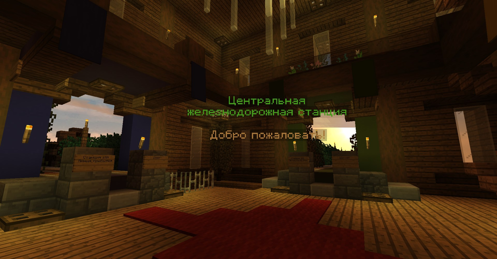

# Поезда

### Вступление

Поезда на Original перемещаются двумя способами: энергорельсы или вагонетки с печкой. Если первый вариант не требует топлива, но достаточно затратен на большие линии, то вагонетка с печкой требует 1 уголь примерно на 1000 блоков.

Вагонетки имеют механику сцепки, когда рядом стоящие вагонетки соединяются в поезд или грузовик. Количество вагонеток в сцепке ограничено.


Сцепка из вагонеток с сундуками называется грузовиком.


Если поставить перед вагонеткой с печкой вагонетку с сундуком и положить в нее уголь, то он будет забираться из сундука автоматически и поезд поедет.


### Начало промышленных поездов. Путь.

Поезда могут управляться табличкой со скриптом. Первая строка всегда содержит

`[train]`

что требует подачи редстоун сигнала к табличке для активации ее работы. Если это станция, то подача сигнала с определенной стороны направит поезд в эту сторону.

Чтобы не требовался редстоун сигнал, следует начать с

`[+train]`

Таблички размещаются:

* под блоком, на котором стоит рельса 
* еще на 1 блок ниже, чем первый вариант
* сбоку блока, на котором стоит рельса.

Если одной таблички для написания скрипта недостаточно, то допустимо ставить табличку с продолжением снизу:


### Пункт назначения

Начните с размещения таблички пункта назначения с названием пункта назначения в третьей строке. Четвертая строка может использоваться для установки нового пункта назначения, к которому следует перейти, когда поезд проезжает табличку, но ее можно оставить пустой. Назовем станцию назначения domik

```text
[+train]
destination
domik
```


### Свойства

Теперь нам нужно, чтобы поезд приехал на эту станцию. Зададим свойство, чтобы поезд, проезжающий по этой линии ехал именно на domik, написав название станции в 4 строке свойств:

```text
[+train]
property
destination
domik
```

Если нужно, чтобы поезд ехал в domik по нажатию кнопки, то создаем станцию с временным ожиданием \(об этом ниже\) с одной стороны блока, на котором стоит рельса, а в свойствах на другой стороне блока не указываем постоянное питание: \[train\], после чего делаем кнопку с подведением сигнала к табличке свойств.

На этом возможности свойств не заканчиваются. Можно ограничить скорость на участке, установим 1,5:

```text
[+train]
property
speedlimit
1.5
```

### Переезды

В местах, где следует переключать дорогу, необходимо разместить табличку переключателя с постоянным включением питания. Теперь, когда поезд движется по нему с установленным пунктом назначения, будет рассчитан маршрут, а затем путь будет переключен.

```text
[+train]
switcher
```


Переключателю можно задавать условия. Например, так поезд повернет направо, если у него есть пункт назначения st1 и поедет прямо в любом другом случае:

```text
[+train]
switcher
r:d@st1
f:default
```

В данном примере поезд едет на восток, если на переключатель подается редстоун сигнал и на запад, если сигнала нет:

```text
[+train]
switcher
e:redstone
w:default
```

Отправит все поезда размером более 5 тележек влево, а поезда с дровами на вагонетках с сундуками - вправо. Он анализирует операторы сверху вниз, поэтому поезда с древесиной, размер которых превышает 5 тележек, также отправляются влево:

```text
[!train]
switcher
l:5
r:i@wood
```

Отправит 3 тележки влево, а затем 4 тележки вправо, после чего цикл повторяется:

```text
[!train]
switcher
3
4
```

Вы можете поставить несколько указателей в линию, чтобы поровну разделить поезда на несколько путей:

[https://www.youtube.com/watch?v=8KCfenk3Vi8](https://www.youtube.com/watch?v=8KCfenk3Vi8)

### Все варианты направлений

Все направления для табличек можно посмотреть в таблице, допустимо указывать как текст, так и символ:

| Текст | Символ | Пояснение |
| :--- | :--- | :--- |
| north | n | север |
| east | e | восток |
| west | w | запад |
| south | s | юг |
| left | l | Влево относительно текста на табличке |
| right | r | Вправо относительно текста на табличке |
| forward | f | Вперед относительно текста на табличке |
| backwards | b | Назад относительно текста на табличке |
| upwards | u | Вертикально вверх |
| downwards | d | Вертикально вниз |
| none | n | Отсутствие направления, никогда не активируется |

### Станции

Станции позволяют останавливать поезд / задерживать на определенное время и выбирать направление дальнейшего движения.

```text
[+train]
station
5
continue
```

**Первая строка**

Когда используется \[train\] , поезд центрируется над знаком. Это означает, что средняя вагонетка поезда остановится над знаком. Когда используется \[cart\] , поезд немедленно останавливается, первая вагонетка располагается по центру над знаком.

**Вторая строка**

station, за которой следует необязательный номер. Это число устанавливает расстояние, на которое запускаются поезда. Чем выше это число, тем медленнее запускается. Используйте только station, чтобы плагин автоматически рассчитывал это расстояние.

**Третья строка**

Необязательная задержка в секундах. Эта задержка используется при запуске. Например, когда на правую сторону подается редстоун сигнал и задана задержка в 3 секунды, и поезд прибывает, поезд будет ждать 3 секунды, а затем двинется в направлении редстоун сигнала.

**Четвертая строка**

Устанавливает режим, используемый при питании обеих сторон. Табличка станции будет запускать поезда в направлении, на которое подано питание. Если на табличку совсем не подается питание, значит, она не активна, и поезда будут проезжать прямо через нее. Опция постоянного питания \(\[!train\]\) работает как если бы все стороны имели сигнал.

Станция будет держать поезд вечно, если обе стороны будут иметь сигнал, если только один из следующих четырех типов не установлен на четвертой строке:

| Табличка | Результат |
| :--- | :--- |
|  |  |
|  |  |
|  |  |
|  |  |

### Обеспечение одного направления

Когда желательно, чтобы поезда двигались только в одном направлении по участку пути, можно использовать табличку блокировки с постоянным включением. Это полезно, когда две дорожки расположены рядом, каждая в противоположных направлениях. Система поиска пути автоматически игнорирует пути, заблокированные табличкуами блокировки.


```text
[+train:right]
blocker
```

С \[+train:left\] поезда, идущие слева, блокируются, разрешается движение только справа налево. Аналогичным образом можно использовать \[+train:right\] и другие направления.

| Текст | Результат |
| :--- | :--- |
| north | Поезда, идущие с севера, заблокированы |
| south | Поезда, идущие с юга, заблокированы |
| east | Поезда, идущие с востока, заблокированы |
| west | Поезда, идущие с запада, заблокированы |
| left | Поезда, идущие слева \(относительно таблички\), заблокированы |
| right | Поезда, идущие справа \(относительно таблички\), заблокированы |
| backwards | Поезда, идущие сзади \(относительно таблички\), заблокированы |
| forwards | Тот же результат, как если бы вы оставили строку пустой |

### Предотвращение столкновений

Можно проверять наличие поездов впереди следования и делать остановку. В таком случае следует создавать ответвления ожидания. Проверим

```text
[+train]
waiter70
```

**Первая строка** Вы можете использовать +train или +cart.

**Вторая строка** Необязательное число \(без пробела\), определяет, на сколько блоков впереди будет смотреть табличка. По умолчанию 30.

**Третья строка** Необязательное число, задержка перед тем, как поезд будет отпущен, если путь впереди пуст. По умолчанию 3.

### Отладка

Рассчитать пути заново, если есть проблемы с автоматическим перенаправлением `/train reroute`

Получите инструмент отладки, теперь, когда вы нажимаете на рельсу, частицы отображают какой маршрут идет к месту назначения.

`/train debug destination`

Или введите следующую команду. Это полезно при отладке определенного пункта назначения, чтобы не отображались частицы для маршрутов и пунктов назначения, которые вам не нужны.

`/train debug destination имя_пункта_назначения`

### Общая железнодорожная сеть

Во все стороны света высоко в воздухе идет общая железнодорожная сеть. Центром является Центральная железнодорожная станция. Используются вагонетки с печкой.




Осью будут координаты  
`-334 140 375`

На станцию можно добраться со спавна - вход есть в здании портала в шахтерку и на парящем острове с рынком. Вагонетка с печкой на участке пути станция-спавн не требуется. На участке не поддерживаются длинные поезда.  


### Путь домой. Присоединение к центральной линии.

Для того, чтобы соединиться с центральной линией нужно поднять рельсы в воздух. Это на ваше усмотрение - прямой мост, винтовой подъем или что-то другое. Подъем нужно выполнить в общем стиле железнодорожного пути, как минимум точку присоединения. То есть ель, дубовая и березовая листва.

Теперь необходимо создать переключатель на основе редстоуна или скриптов для поворота вагонетки. То есть вагонетка останавливается на пару секунд, если кнопка была нажата, то повернете к себе в поселение. Все на ваше усмотрение, с кнопкой наиболее очевидный пример. Попросите помощи у других при возникновении сложностей. При строительстве разветвления учтите оба направления движения и правила использования.  
  
Пример реализации двустороннего поворота скриптами:  
`Северная ветка, -1850`  
Пример реализации одностороннего поворота механизмом:  
`Северная ветка, -2717`

### Правила использования общей железнодорожной сети

1. Движение правостороннее.
2. Не оставлять на путях вагонетки.
3. Не меняйте основную прямую траекторию движения.
4. Не замедляйте или не останавливайте поезд более чем на 5 секунд.
5. При продлении линии копируйте ее стиль.

### Общие пути назначения

Можно назначить Центральную станцию как путь назначения, если вы соединены с Центральной железной дорогой. Определите, к какой стороне света относится ваша линия и укажите в таблички со свойствами соответствующее название:  


| Сторона света | Название точки назначения  |
| :--- | :--- |
| восток | stE |
| север | stN |
| запад | stW |
| юг | stS |

