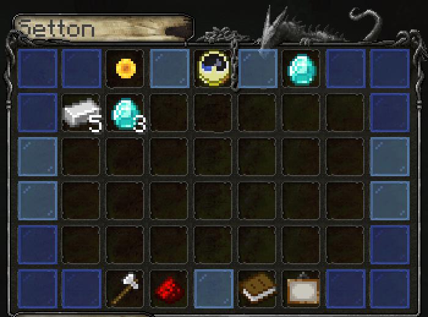

# Поселения

## Назначение и возможности

* Физическая защита территорий от гриферства
* Четкий аудит доступа
* Ограничение прохода на территорию
* Защита от природных явлений \(молния, огонь\)
* Защита от мобов
* Уведомление при входе в поселение и выходе
* Звуковое сопровождение

|  | Поселения | Приваты |
| :--- | :--- | :--- |
| В основном предназначено для защиты | ❎ | ✅ |
| Быстрое создание | ✅ | ❎ |
| Требует ресурсы за использование | ✅ | ❎ |
| Зонирование и роли | ❎ | ✅ |
| Защита от природных явлений | ✅ | ❎ |
| Поддержка больших размеров территорий | ✅ | ❎ |
|  |  |  |

## Руководство

### Создание поселения

Находим желаемое место и пишем:

```
/c claim 
```

Теперь создадим Монумент. Ставим сундук вылаживаем в нем крафт. Посмотреть крафт можно командой:

```
/c recipe
```


 Ставить Монумент нужно в том же чанке, в котором была прописана команда.


Из монумента можно управлять настройками поселения, отслеживать поселенцев и их активность.



### Переименование поселения

Поселение изначально имеет имя как никнейм руководителя. Для смены используется команда:

```
/c name <название> 
```

### Расширение поселения

Расширение земель происходит несколькими способами:

* по одной территории
* радиусом, чтобы получить квадрат
* радиусом, чтобы получить круг

Соответственно:

```
/c claim
/c square <радиус>
/c round <радиус>
```

### Добавление поселенцев

Для того, чтобы пригласить поселенца, нужно написать команду:

```
/c invite <никнейм>
```

А поселенцу, в свою очередь, принять приглашение:

```
/c accept
```

### Поддержка Монумента

 Монумент требует ресурсы для своего функционирования. Это может быть:

* железо
* золото
* изумруды
* алмазы
* монетки

Каждый ресурс добавляет какое-то количество времени. Если ресурсы закончатся, то в течение пары дней поселение распадется.

## Список команд

```
/c - Помощь по командам.
/c reload - Перезагрузить плагин.
/c claim - Создать поселение или расширить его.
/c unclaim - Освободить землю, на которой вы стоите.
/c show - Визуализировать территорию поселения.
/c invite <игрок> - Пригласить в поселение.
/c accept - Принять приглашение на вступление в поселение.
/c addmember <игрок> - Добавить поселенца.
/c kick <поселенец> - Прогнать поселенца.
/c dissolve - Распустить поселение.
/c leave <поселение> - Покинуть поселение.
/c lock - Запретить входить гостям в поселение.
/c home <поселение> - Телепортация в поселение.
/c sethome - Установить центр поселения.
/c ban <игрок> - Запретить игроку входить на ваши земли.
/c unban <игрок> - Снова разрешить игроку входить на ваши земли.
/c recipe - Показать крафт Монумента.
/c setspawn - Установить центр поселения.
/c name <название> - Переименовать поселение.
/c setowner <поселенец> - Передать права на руководство поселением.
/c square <радиус> - Расширить поселение по радиусу - квадрат.
/c round <радиус> - Расширить поселение по радиусу - окружность.
/c admin removeclaim - Модератор может распустить поселение.
/c admin transferownership <игрок> - Модератор может сменить владельца поселения.
/c admin name <название> - Модератор может сменить название поселения.
/c admin lock - Модератор может управлять входом в поселение для гостей.
```

