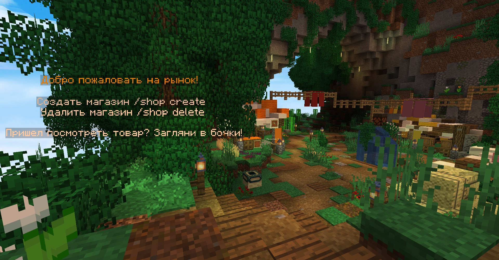
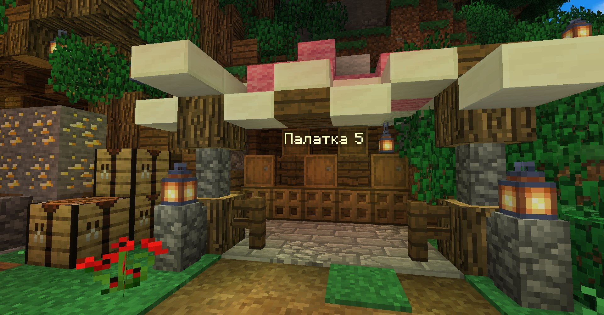
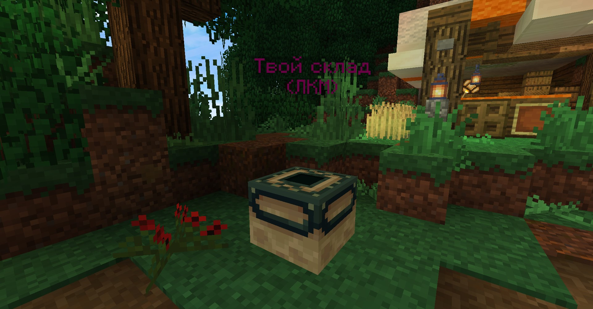

# Рынок

### Механика

Рынок состоит из торговой ячейки и склада. В торговой ячейке вы покупаете или начинаете продажу, на склад кладёте товар и забираете выручку.

### Создаем рынок

Ставим бочку, пишем /shop create и нажимаем по бочке. Если бочка уже установлена, то переставлять ее не обязательно: откройте ее, закройте и напишите эту же команду. 

### Склад

На данный момент склад открывается нажатием по блоку энд-портала, он находится так же на рынке.

### Создаем лот

В инвентаре берем нужное количество продаваемого товара и опллаты. В данном примере мы будем продавать 1 золотое яблоко за 10 алмазов

Открываем свой рынок и нажимаем зеленую кнопку СОЗДАТЬ

Вылаживаем лот, предметы не забираются, а копируются

Нажимаем кнопку СОЗДАТЬ

Готово, если что лот всегда можно УДАЛИТЬ

Теперь положим товар на склад

 

Удачной торговли!

### Примечания

* Магазин удаляется после 14 дней оффлайн.
* Можно поставить не более 3 магазинов.
* Склад имеет 2 страницы вместимости, если они заполнятся поступающая выручка будет пропадать.
* Рынок уведомит в чате, если кто-то что-либо купил. Даже если это было сделано, когда вы были оффлайн.

